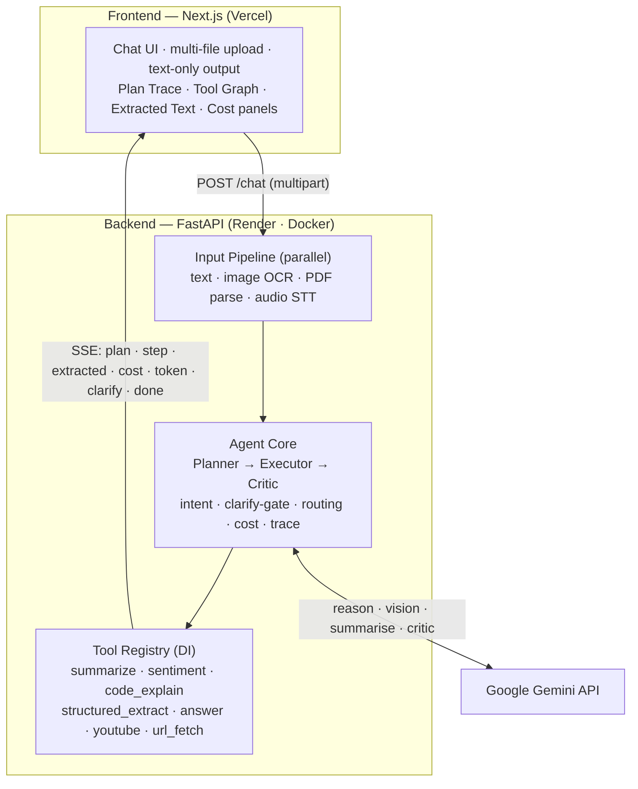

# SmartBot — Agentic Multimodal Assistant

A deployed, agentic application that accepts **multiple input types simultaneously** (Text, Images, PDFs, Audio), extracts their content, understands the user's goal across the combined context, and **autonomously plans and executes the correct task** — including complex, multi-step queries that chain several tools in a single request. When the goal is ambiguous, the agent asks a follow-up question instead of guessing. All final outputs are text-only.

Built for the **DSAI Assignment (June 2026)**.

---

## Live deployment

| Surface | URL |
|---|---|
| **Frontend (primary demo)** | _<add your Vercel URL>_ |
| **Backend API** | _<add your Render URL>_ |
| API health check | `<render-url>/health` |
| API docs (Swagger) | `<render-url>/docs` |

> Replace the placeholders after deploying (see [Deployment](#deployment)).

---

## Table of contents

- [Highlights](#highlights)
- [Architecture](#architecture)
- [Tech stack](#tech-stack)
- [Repository structure](#repository-structure)
- [Supported inputs & tasks](#supported-inputs--tasks)
- [Agent behaviour](#agent-behaviour)
- [Sample test cases](#sample-test-cases)
- [Local setup](#local-setup)
- [Environment variables](#environment-variables)
- [Deployment](#deployment)
- [Testing & quality](#testing--quality)
- [Bonus features](#bonus-features)
- [Requirement → implementation map](#requirement--implementation-map)
- [Troubleshooting](#troubleshooting)
- [Security notes](#security-notes)

---

## Highlights

- **True multimodal input** — text + image + PDF + audio, multiple files in one request, extracted in parallel.
- **Autonomous planner + LLM router** — an LLM decides intent and which documents are relevant (keyword fallback offline); builds the *minimum* tool chain for the goal.
- **RAG for document Q&A** — chunk → embed (Gemini) → in-memory cosine index → top-k page-cited chunks, gated by document size (full context for small docs, retrieval for large — optimized for accuracy, relevance, and latency).
- **Mandatory clarify-gate** — refuses to guess on ambiguous input and asks a short follow-up instead.
- **Self-correcting critic** — validates output format (e.g. the strict summary structure) and repairs it once if needed.
- **Full transparency** — live plan trace, tool-call graph, extracted-text panel, and an estimate-vs-actual cost panel, all streamed over SSE.
- **Robust** — graceful partial failures, retries with model fallback, and offline heuristic fallbacks so the app still responds when the LLM is unreachable.

---

## Architecture



**Flow:** every input is extracted/transcribed in parallel → the planner reasons over the combined context and builds the minimal tool chain → the executor runs each step, streaming a live trace with timing → a critic validates the result → the final answer streams token-by-token. Cost is estimated before the run and reconciled with actuals after.

---

## Tech stack

**Frontend:** Next.js (App Router, TypeScript), Tailwind CSS + shadcn/ui, SSE streaming client. Deployed on **Vercel**.

**Backend:** FastAPI + Uvicorn (async, DI via `Depends`), **Google Gemini** (`gemini-2.5-flash` default, `gemini-2.5-pro` for hard/ambiguous reasoning + fallback). Deployed on **Render** via Docker.

**Extraction:** PyMuPDF (PDF) with Tesseract OCR fallback for scanned pages; Tesseract + Gemini vision for image OCR (with confidence); faster-whisper for audio STT (with duration); `youtube-transcript-api` and `httpx`+BeautifulSoup for URL/transcript fetching.

**Quality:** pytest + FastAPI `TestClient`, ruff lint, Docker for reproducibility.

---

## Repository structure

```
smartBot/
├── backend/                  # FastAPI agent
│   ├── app/
│   │   ├── main.py           # app, CORS, /health, POST /chat (SSE)
│   │   ├── config.py         # settings + model/price table
│   │   ├── schemas.py        # pydantic event models (match frontend types)
│   │   ├── deps.py           # DI providers
│   │   ├── gemini_client.py  # retry + flash→pro fallback wrapper
│   │   ├── sse.py            # SSE event encoders
│   │   ├── pipeline/         # parallel extractors: text, image_ocr, pdf, audio_stt
│   │   ├── agent/            # planner, executor, critic, cost
│   │   └── tools/            # registry + one file per tool
│   ├── tests/                # pytest: unit + sample test cases
│   ├── Dockerfile            # ffmpeg + tesseract + poppler bundled
│   ├── render.yaml           # Render blueprint
│   ├── requirements.txt
│   └── README.md             # backend-specific notes
├── frontend/                 # Next.js app (chat UI + panels)
│   └── src/
│       ├── app/              # chat page
│       ├── components/       # chat, panels (trace, graph, extracted, cost)
│       └── lib/              # api client (REST + SSE), types, mock
├── DSAI Assignment June 2026.pdf
├── PLAN.md                   # design decisions & build plan
└── README.md                 # this file
```

---

## Supported inputs & tasks

**Inputs:** Text (plain/structured), Image (JPG/PNG → OCR), PDF (text or scanned → parse + OCR fallback), Audio (MP3/WAV/M4A → speech-to-text). Multiple inputs are accepted and combined in a single request.

**Tasks the agent handles:**

1. **Image/PDF text extraction** — cleaned transcript + OCR confidence.
2. **YouTube transcript fetching** — detects a URL anywhere in any input → fetches the transcript (graceful fallback if none).
3. **Conversational answering** — friendly, helpful responses for general questions.
4. **Summarization** — 1-line summary + exactly 3 bullets + 5-sentence summary.
5. **Sentiment analysis** — label + confidence + one-line justification (3-vote majority).
6. **Code explanation** — what it does, detected bugs, time complexity.
7. **Audio transcription + summary** — transcribe → summarize (same 3 formats) + clip duration.
8. **Cross-input reasoning** — combine content from multiple inputs to answer a unified query.

---

## Agent behaviour

**Intent understanding.** The planner extracts/transcribes all inputs, identifies the goal across the combined context, detects constraints (format/timing), and resolves cross-input references — for example, a YouTube or web URL found inside a PDF is fetched when the query implies it.

**Mandatory follow-up rule.** If the input lacks enough information to determine the task, or multiple tasks are equally plausible, the agent does **not** guess. It returns a short clarifying question (e.g. *"Could you clarify whether you want a summary or sentiment analysis?"*) and only proceeds after the user responds.

**Autonomy.** Once the goal is clear, the agent plans the minimum viable tool sequence and executes it end-to-end without step-by-step prompting, chaining multiple tools when required.

---

## Sample test cases

| # | Input | Expected behaviour |
|---|---|---|
| 1 | Audio lecture (~5 min) | Transcribe → 1-line + 3 bullets + 5-sentence summary + duration |
| 2 | 3-page PDF of meeting notes + "What are the action items?" | Extract text → return only the action items |
| 3 | Image screenshot of a code snippet + "Explain" | OCR → detect language → explain + flag bugs |
| 4 | PDF containing a YouTube URL + "Hit the YT URL in this PDF and give me a summary of it" | Extract PDF → detect URL → fetch transcript → summarize (no prompting between steps) |
| 5 | Audio + PDF + "Do the audio and the document discuss the same topic?" | Transcribe + parse → comparative cross-input analysis |

These are exercised end-to-end in `backend/tests/` (cases 2 and 4 run offline; all chain logic is unit-tested).

---

## Local setup

Run the **backend** and **frontend** in two terminals.

### Backend (FastAPI)

```bash
cd backend
python -m venv .venv
# Windows: .venv\Scripts\activate    |    macOS/Linux: source .venv/bin/activate
.venv\Scripts\activate
pip install -r requirements.txt

cp .env.example .env          # then put your real GEMINI_API_KEY in .env
uvicorn app.main:app --reload --port 8000
```

Health: `http://localhost:8000/health` → `"llm_configured": true` once the key loads.

For full functionality the backend needs three system binaries — **tesseract-ocr** (image/PDF OCR), **poppler-utils**, and **ffmpeg** (audio). They are bundled in the Docker image, so the simplest path on Windows is Docker:

```bash
cd backend
docker build -t smartbot-backend .
docker run -p 8000:8000 -e GEMINI_API_KEY=your_key smartbot-backend
```

(Text, digital PDFs, and YouTube/URL tasks work without those binaries; only image OCR and audio need them.)

### Frontend (Next.js)

```bash
cd frontend
npm install
# point the UI at the backend (UTF-8 file, no BOM):
printf 'NEXT_PUBLIC_API_URL=http://localhost:8000\n' > .env.local
npm run dev
```

Open **http://localhost:3000**. If `NEXT_PUBLIC_API_URL` is unset the UI runs a built-in mock; setting it switches to the real backend. Restart `npm run dev` after changing `.env.local`.

---

## Environment variables

### Backend (`backend/.env`)

| Var | Required | Default | Purpose |
|---|---|---|---|
| `GEMINI_API_KEY` | yes* | — | Gemini key from [AI Studio](https://aistudio.google.com/apikey) |
| `GEMINI_MODEL_FAST` | no | `gemini-2.5-flash` | Fast model for most calls |
| `GEMINI_MODEL_PRO` | no | `gemini-2.5-pro` | Heavy/ambiguous reasoning + fallback |
| `GEMINI_EMBED_MODEL` | no | `models/gemini-embedding-001` | Embeddings for RAG retrieval |
| `ALLOWED_ORIGINS` | no | `http://localhost:3000` | Comma-separated CORS origins (add your Vercel URL in prod) |
| `WHISPER_MODEL` | no | `base` | faster-whisper size: tiny\|base\|small\|medium |
| `MAX_FILE_MB` | no | `25` | Reject larger uploads |

\* Without a key the API still runs using deterministic heuristic fallbacks (handy for tests), but answer quality is limited.

### Frontend (`frontend/.env.local`)

| Var | Required | Purpose |
|---|---|---|
| `NEXT_PUBLIC_API_URL` | yes (prod) | Base URL of the backend, e.g. `https://smartbot-backend.onrender.com` |

---

## Deployment

Do the four steps in order — it avoids the CORS chicken-and-egg (each side needs the other's URL).

### 0. Push to GitHub
```bash
git add -A && git commit -m "Deploy" && git push
```

### 1. Frontend → Vercel (get the frontend URL first)
1. Vercel → **Add New → Project**, import the repo.
2. Set **Root Directory = `frontend`** (Framework auto-detects as Next.js).
3. Deploy (no env var yet → it runs in built-in **mock mode**). Copy the URL, e.g. `https://smartbot.vercel.app`. **This is the primary demo URL.**

### 2. Backend → Render (Docker blueprint)
1. Render → **New → Blueprint**, select the repo → it reads `backend/render.yaml` (Docker web service rooted at `backend/`).
2. Set these in the Render dashboard (both are `sync: false`, never in the repo):
   - `GEMINI_API_KEY` — your key from [AI Studio](https://aistudio.google.com/apikey).
   - `ALLOWED_ORIGINS` — the Vercel URL from step 1 (e.g. `https://smartbot.vercel.app`).
3. Deploy. Health check is `/health`. Copy the URL, e.g. `https://smartbot-api.onrender.com`.

### 3. Point the frontend at the backend
1. Vercel → your project → **Settings → Environment Variables** → add `NEXT_PUBLIC_API_URL` = the Render URL from step 2.
2. **Redeploy** the frontend (Deployments → ⋯ → Redeploy) so the var is baked in.

### 4. Verify
- `https://<render-url>/health` → `{"status":"ok","llm_configured":true}`.
- Open the Vercel URL, load a sample from the gallery, and send.

**Free-tier notes (important):**
- Render **free** = 512 MB RAM and **spins down after ~15 min** idle (first request then takes ~50 s to wake). Text / PDF / image / YouTube work well.
- **Audio** transcription is memory-heavy: the blueprint uses `WHISPER_MODEL=tiny` so it fits 512 MB. For better audio accuracy, upgrade the Render service to a paid plan (2 GB) and set `WHISPER_MODEL=base` (or `small`).
- To keep the demo warm, hit `/health` on a cron (e.g. cron-job.org) or upgrade off the free plan.

---

## Testing & quality

```bash
cd backend
pytest            # unit tests + sample test cases (runs offline, no key needed)
ruff check .      # lint
```

The test suite covers URL/YouTube detection, intent detection, the clarify-gate, the summary-format validator, and end-to-end `/chat` SSE runs for sample cases 2 and 4.

---

## Bonus features

- **Cost estimator** — predicted token cost shown *before* execution, reconciled with actual usage *after* (estimate-vs-actual cost panel).
- **Streaming output** — the answer streams token-by-token into the chat over SSE.
- **Tool-call visualization** — a live plan trace and tool graph show which tools ran, in what order, with per-step timing and a one-line rationale.

---

## Requirement → implementation map

| Assignment section | Where it's implemented |
|---|---|
| §1 Inputs (multi-type, simultaneous) | `app/pipeline/*` + `dispatch.extract_all` (parallel) |
| §2A Intent & cross-input references | `app/agent/planner.py` (intent, URL detection, routing) |
| §2B Mandatory follow-up | planner clarify-gate → `clarify` SSE event |
| §3 Eight tasks | `app/tools/*` (one module per tool) |
| §4 Deployment | `backend/Dockerfile`, `backend/render.yaml`, Vercel for frontend |
| §5 UI requirements | `frontend/src/components/*` (chat, upload, panels) |
| §6 Deliverables | this README, architecture diagram, FastAPI + Next.js, Docker, tests |
| §7 Rubric | correctness (critic), autonomy (planner), robustness (fallbacks), explainability (trace), code quality (modular + ruff + tests), UX (panels) |
| §8 Test cases | `backend/tests/` |
| §9 Bonus | cost estimator, streaming, tool-call visualization |

---

## Troubleshooting

**The answer looks canned / always identical.** The frontend is in mock mode. Set `NEXT_PUBLIC_API_URL` in `frontend/.env.local` (UTF-8, no BOM — avoid PowerShell `>` which writes UTF-16) and restart `npm run dev`.

**Answers fall back to heuristics even with a key set.** Your Gemini model names may be retired. Use current models (`gemini-2.5-flash`, `gemini-2.5-pro`). Failures now surface as `Gemini call failed: …` in the UI so you can see the exact cause. To list models your key can access:

```bash
python -c "import google.generativeai as genai, os; genai.configure(api_key=os.environ['GEMINI_API_KEY']); [print(m.name) for m in genai.list_models()]"
```

**Image OCR or audio returns nothing locally.** Install `tesseract-ocr` / `ffmpeg`, or run the backend via Docker (both are bundled).

---

## Security notes

- Never commit secrets. `backend/.env` is gitignored; `backend/.env.example` is a **committed template and must stay empty** of real keys.
- Put your real key only in `backend/.env` locally and in the Render dashboard for production.
- If a key is ever exposed, rotate it at [AI Studio](https://aistudio.google.com/apikey) (delete + create new).
